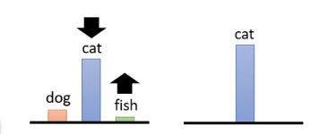
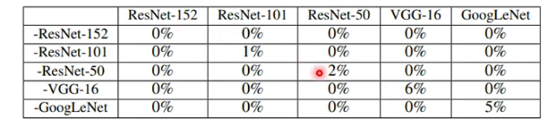

# Adversarial Attack

Train models able to get high accuracy under the adversarial attack

**Example**: Add noises to benign image, converting it to attacked image and if the model get wrong answer the attack is successful

## How to Attack

**Non-targeted Attack**:

Making the result as far from the correct answer as possible

The loss is negative cross-entropy and we hope it can be small

$ \underset{ d ( x^0 , x ) \leq \epsilon }{ \min } $ means the differences cannot be perceived by human 

$$ x^{*} = arg \underset{ d ( x^0 , x ) \leq \epsilon }{ \min } \  L ( x ) \\ L ( x ) = - e ( y , \hat{ y } )$$

**Targeted Attack**:

$$ L ( x ) = - e ( y , \hat{ y } ) + e ( y , y^{ target } )$$

### Two Ways to Compute the Differences

1. L2-norm: $$ d ( x^0 , x) = \| \Delta x \|_2 = ( \Delta x_1) ^ 2 + ( \Delta x_2) ^ 2 + ( \Delta x_3) ^ 2 \dots $$

2. L-infinity: $$ d ( x^0 , x) = \| \Delta x \|_{\infty} = \max \{ | \Delta x_1 | , | \Delta x_2 | , | \Delta x_3 | , \dots \} $$

In pictures usually we use L-infinity because even a small part of huge difference can be detected by human

We view the input image as parameters to do gradient descent to minimize the loss function

And in this case we need to consider the costraint $ \epsilon $ and fix the new x to the nearest correct x

### Attack Approach

#### Fast Gradient Sign Method (FGSM)

Only change the parameter once by taking the symbol to move the new x to the corner of the square

If iterating for more than one time we need to fix, and the result will be better

### White Box Attack

The model's parameters are public

### Black Box Attack

The model's parameters are private

If we have the training data we can train a proxy model by ourself to generate attack objects

Else we can use the input and output as pairs to train a proxy model

Black box attack is more likely to be successful in non-targeted attack

#### Ensemble Attack

We use white box to get attacked image from other models

In this picture only the attack in the diagonal is black box attack

### One Pixel Attack

Only change one pixel to attack

### Universal Adversarial Attack

One pixel can make a lot of pictures become unreconizable

## Beyond Images

In other domains attack is also possible

## Attack in the Physical World

We can use many ways to cheat the mage recognition system

## Adversarial Reprogramming

Making the original recogonition system to do things far from its correct function

## Backdoor in Model

Attack in the training process

# Defense

## Passive Defence

Add a filter to make the attacked picture less harmful

For example we can blurring the image but excessive blurring can be harmful

### Randomization

The attacker can add the same layer of your blurring to blur the image ahead to break the defense, so we use randomization to avoid the case

## Proactive Defense

### Adversarial Training

We label the attacked image produced by ourselves to train the model

Someone view the method as **data augmentation**

We may not consider all the attack cases and we need a lot of training resources