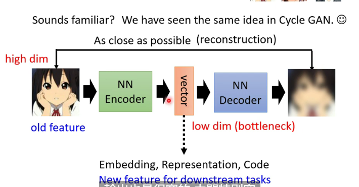
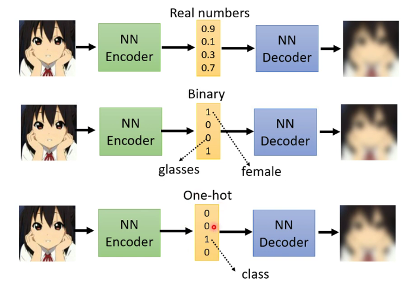

# Auto-encoder

A type of self-supervised learning, similar to Cycle GAN

The model compress the input then recover it in the output

### Dimension Reduction

We compress the high-dim input to low-dim input by encoder as embedding

**Effect of Dim Reduction:** Though the input seems complex, actually we can use simple way to express by compression

### De-noising Auto-encoder

Add noises to the input then get the original input as output

### Feature Disentangle

The information is tangled in the embedding hard to tell the meaning of one dimension, so we need to disentangle

### Discrete Representation

The embedding may be binary of one-hot

#### Vector Quantized Variational Auto-encoder (VQVAE)

We compare the embedding with vectors in codebook and extract the most similar one to get the output

By this way we can get discrete and finite output

### Text as Representation

The embedding is the summary, using GAN to get the correct summary, then put in into the decoder

### Generator

Decoder function as a generator, getting a output by the input vector

### Anomaly Detection

Pick out the anomaly data