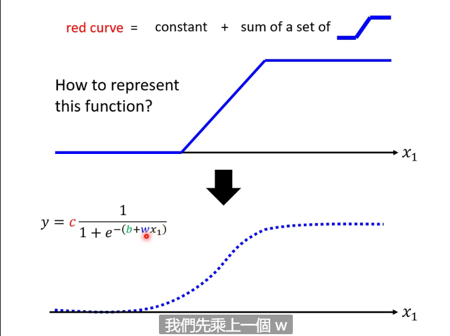
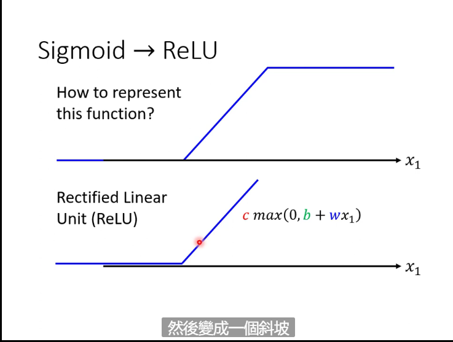
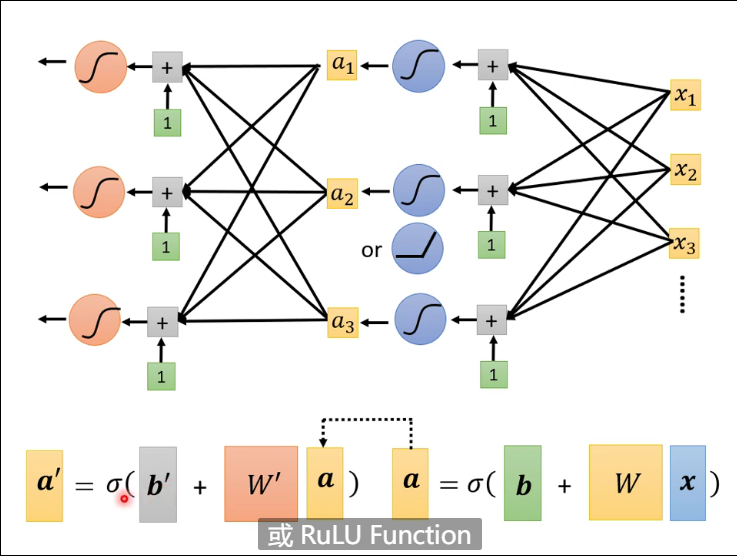

# Class 1 Introduction

## Machine Learning

Input data to a function to get a result

### Three Types

1.Regression
2.Classification
3.Structured Learning

### Three Steps For ML

#### 1.Predict the Function

y=wx+b e.g.(w,b are unknown parameters)
#### 2.Loss
a function of the paraments, L(w,b) e.g., to test whether the parameters selected are good:$L=\frac{1}{N}\sum_{n}e_n$

MAE(mean abosule error): $e_n=|y-\hat{y}|$
MAE(mean square error): $e_n=(y-\hat{y})^2$

Your choice depend on your need

#### 3.Optimiziation

Find the best w,b(w*,b*) using the method called **Gradient Descent**:

#### e.g.

---

Suppose that there's only one parameter called **w** in the 2-D function. Select a point **w** in the  function randomly.Compute $\eta\left.\frac{\partial_L}{\partial_w}\right|_{w=w_0}$ , it decides the moving direction(to the decreasing direction) and moving step(the length). $\eta$ is the **learning rate** set by yourself, the larger it is, the faster the parameters change.(It's a type of **hyperparameter** which means the parameters need to be set by programmers)

w is updated iteratively
$$w^1=w^0-\eta\left.\frac{\partial_L}{\partial_w}\right|_{w=w_0}$$

The stop condition e.g.:
1:Reach the limitation of iteration
2:Reach the point where $\left.\frac{\partial_L}{\partial_w}\right|_{w=w_0}=0$ (it may reach a local minima which is not the best point)

We use the **training data**(the known data) to predict the future, and compare it to the **test data**(real data). So we need to continue the opimization according to your domain knowledge

---

The model we use here is called **Linear Model**, standardlized by $$y=b+\sum_{i=1}^nw_ix_i$$

We can also use piewise linear made up of a constant and several simple functions, and we use **sigmoid** to be close to the funtion$$y=c\frac{1}{1+e^{-(b+wx_1)}}$$

Then we get the function$$y=b+\sum_{i}c_isigmoid(b_i + \sum_j w_{ij} x_j)$$

Now there're too many parameters so we use L($\theta$) instead of L(w,b), and the gradient is called $g=\nabla L(\theta)$

And we actually separate the parameters into many **batches** to calculate separately
**Update**:update all parameters
**Epoch**:update all batches

And we can transform a hard sigmoid into two **ReLUs**(Rectified Linear Unit) which is more easier to get the function$$y=cmax \{ 0,b+wx \} $$

So now the function becomes $$y=b+\sum_{2i}c_icmax \{ 0,b+\sum_jw_{ij}x_j \} $$

Sigmoid and ReLU all belong to **activation funtion**

We can use the function for many times and each time is called a **layer**

Each funtion is called a **neuron**, and they are called **neuron network** together. Now the neuron is called a **hidden layer**, and many layers consist a **Deep Learning Model**

If a deep learning model become better in training model but worse in the testing model, this is called **overfitting**