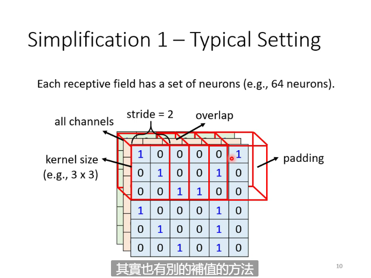
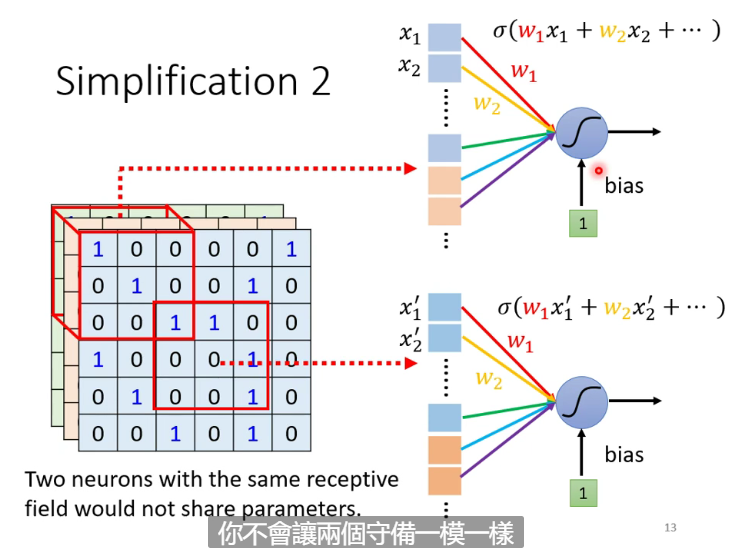
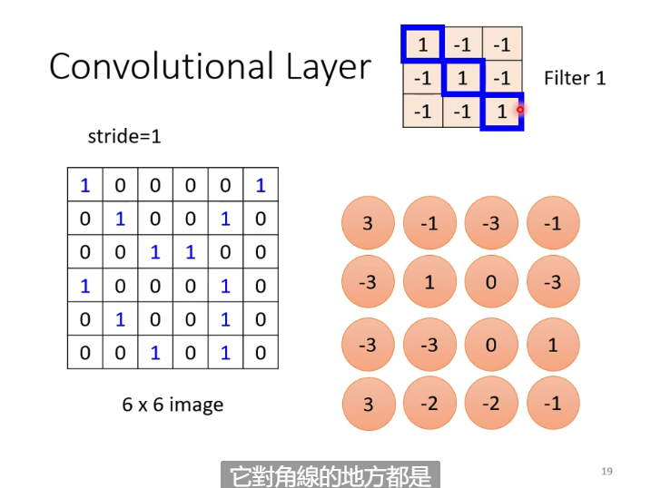
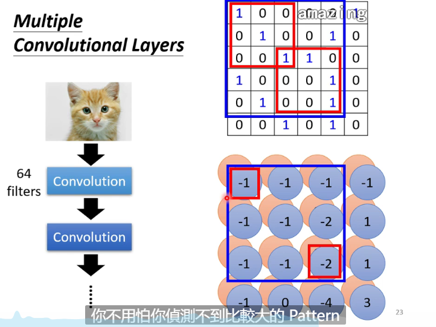
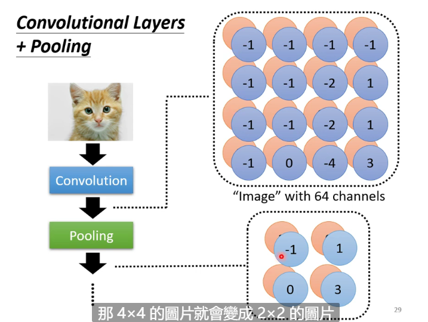

# Convolutional Neural Network

**It's designed for Image classification**

Only some small fractions of the image (patterns) can classify the image

## Receptive Field

Make neurons only focus on the receptive field in the charge of it

A receptive field can overlap other ones and have more than one nuerons in charge of it

Shape of receptive field is not fixed

### Kernel Size

Usually a field include all channels and its size (length, width) is called **kernel size** which is usually 3$\times$3

Usually a field will be defended by several neurons

### Stride

The distance that a field move to an adjacent one is call **stride**, usually 1 or 2 to make fields overlap to avoid the case that a pattern lies in the border of two fields that no neuron can detect it

### Padding

If a field exceed the margin of the image, we will do **padding** to do imputation (usually add zeros)

## Parameter Sharing (filter)

Make some nuerons have the same parameters to do the same job

Every receptive field have the same parameters in the neurons defend them, and the parameters are called **filters**

The combination of receptive field and parameter sharing is what we called **convolutional neural layer**

The neural network uses convolutional neural network is called **convolutional neural network** which is specifically designed for image processing

## Feature Map

The matrix gotten from the inter product of the image and filters

**An Examole of Inter Product**

$$\left[ \begin{matrix} 1 & 0 & 0 \\ 0 & 1 & 0 \\ 0 & 0 & 1 \end{matrix} \right] \left[ \begin{matrix} 1 & -1 & -1 \\ -1 & 1 & -1 \\ -1 & -1 & 1 \end{matrix} \right] = 3$$

By convolution, a n * n * channel_num image becomes a new field_length_num * field_width_num * neuron_num image

In a deeper layer a filter can capture more pixels because the pixels of the image in the previous layer is the convolution result of pre-previous layer's image

## Pooling

We do **subsampling** to a image to extract some rows and columns of pixels

### Max Pooling

Choose the largest pixel in a batch of pixels then remove other pixels in it

*This is only one specific way of pooling*

Pooling may do some damages, so now some modern classification method desert pooling, only doing convolution because the power of computation increases

**Playing Go AI can use CNN**