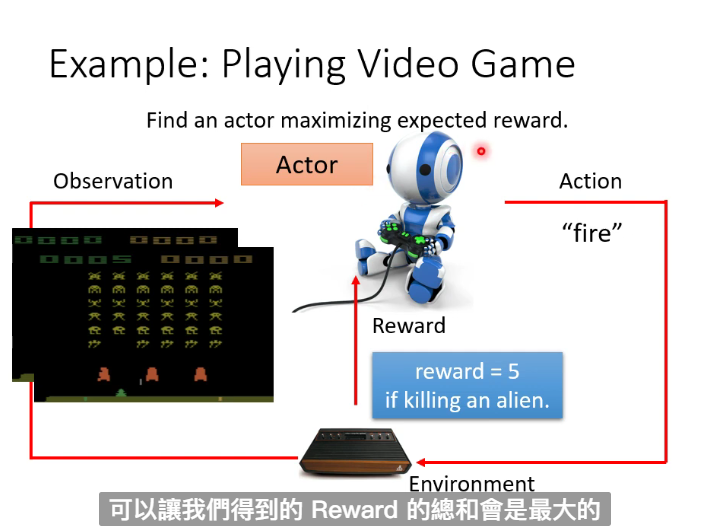
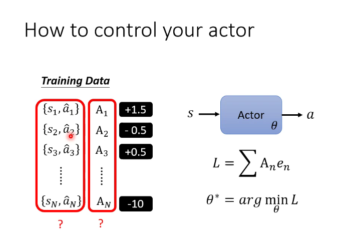
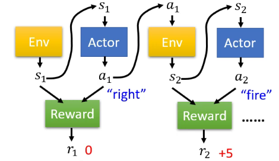
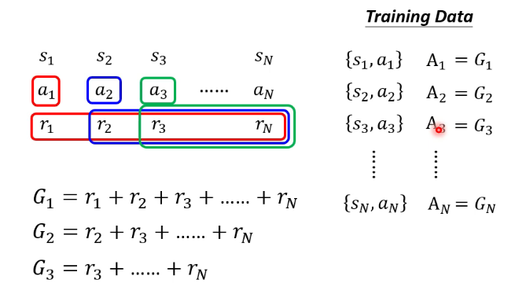
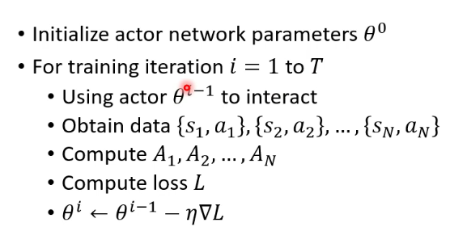
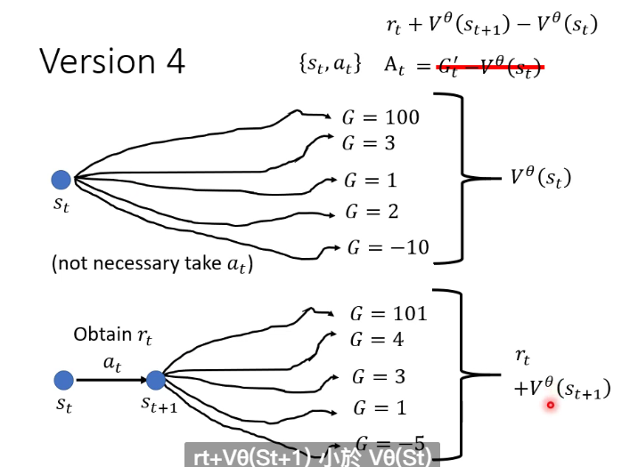
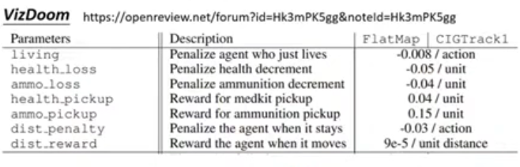

# Deep Reinforcement Learning

RL do not need labels and machine do not know which is the most optimistic choice

In RL we have an actor and an environment

The environment will give actor an observation

Then actor will ouput action to influence the environment

The environment will give the actor some reward

Actor is actually the function we desire to maximize the reward

## Step1：Define Network

We can choose the nn according to our need

The output will resemble the output of classifier and choose the action with highest score

## Step2: Define Loss

We get the total reward(return) after the termination, this is what we want to maximize so we view negative total reward as loss

## Step3: Optimization

We call the training sequence as trajectory

In RL the reward and environment is similar to discriminator but they are black box

## Policy Gradient

The training process of actor is similar to classifier

If you want the actor not to do something, let the loss be negative

We can give weights to some actions to control their probabilty of being done

### Define A

We need to search the pair of $< s , a >$

s is the input from environment, a is the output of actor

Then we try to assess the actions by the rewards

An action affects the subsequent observation and thus subsequent rewards

**Reward Delay**:Actor has to sacrifice immediate reward to gain more long-term reward like move for some steps before firing in the space invader game

#### Cumulated Reward

##### Version 1

We use the sum of the reward subsequent to $a_i$ as $A_i$

$G_t = \sum\limits_{ n = t }^{N} r_n $

##### Version 2

However if the running process is to long $a_i$ may not affect all the subsequent rewards, so we multiple a discount factor $\gamma < 1$

$$ G_t^{'} = \sum\limits_{n = t}^{N} \gamma^{ n - t } r_n $$

After multiple gamma for many times it will be near zero

##### Version 3

Do normalization because good or bad is "relative" (e.g. 1: every one get 60 2:Only your score is less than 60)

We can minus a baseline(b) for every $G_i$

#### Policy Gradient

After update of parameter you need to search for data again which consumes a lot of time

#### Off-policy Gradient

The actor to train and the actor for interacting be different so in this way we don't need to update for many times

The experience proviced by actor to train cannot be all adopted

### Exploration

The actor need to have randomness or some actions may not be executed

We can enlarge output entropy or add noises to parameters

## Actor-Critic

### Critic

**Critic**:Given actor $\theta$ and access how good it is when observing s and taking action a

**Value Function $V^{\theta}(s)$**: Output the expected discounted cumulated reward and ^represents the action

#### How to Estimate $V^{\pi}(s)$

**Monte-Carlo (MC) based approach**:

Observe the cummulated reward

$V^{\theta}(s_t)$ should be close to $G^{'}_t$

**Temporal-difference (TD) approach**：

We don't need to finish the whole game

$$V^{\theta}(s_t)=\gamma V^{\theta}(s_{t+1}) + r_t$$

$V^{\theta}(s_t)-\gamma V^{\theta}(s_{t+1})$ should be close to $r_t$

##### Version 3.5

Set baseline to $V^{\theta}(s_n)$ is reasonable

We randomly sample a action instead of select the best actor to compute $V^{\theta}(s_n)$

We get a $G_t$ from a process of selecting best actor

$A_t>0$ means the action is better than average

##### Version 4

We get a $V^{\theta}(s_{n+1})$ after random sampling

$$A_t = r_t + V^{\theta}(s_{t+1}) - V^{\theta}(s_t)$$

### Tips

Actor and Critic can have some equivalent parameters

## Reward Shaping

### Sparse Reward

If almost all the rewards are 0 we don't know actions or good or bad

We need extra reward to help the learning

We set the reward according to the condition

We can also give the machine some curiosity but in this way machine may always try to see the noises

## No Reward: Learning from Demonstration

Reward may lead to wrong direction, so we use demonstration of the expert to learn (Behavior Cloning)

But we also have the problem that the observation is limited so they cannot handle unusual condition, and not all the actions of human need to be imitated

The reward is set by the machine, backsteped from the demonstration and environment

The reward function will make the reward of the expert higher than that of the machine to help the machine maximize the reward

We can view the actor as generator and the reward function as discriminator