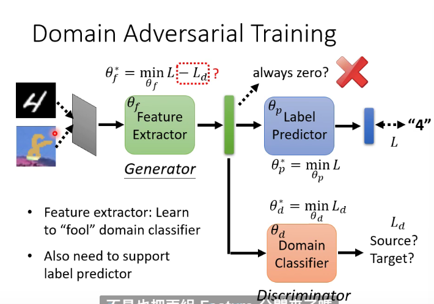

# Domain Adaptation

## Domain Shift

Training and testing data have different distributions
### Labeled

If the target domain has labels but limited number, we can fine-tune the model to adapt

However, too much iteration may lead to overfit to target domain instead of source domain

### Unlabeled

We can use a feature extractor to extract the same features of two domains

We can view some layers in the front as feature extractor and those in the back as label prdictor

We hope that the features extracted from source and target have no difference 

We can view feature extractor as generator and we add a domain classifier like a discriminator to discriminate whether it's from source or target

By this way feature extractor will extract their same features

Like GAN, if the loss of discriminator is large the loss of generator will be small

And because feature extractor need to make label predictor have low loss, the loss of feature extractor will be **loss of predictor - loss of domain classifier**

This way will split the source and target instead of integrating them, so it may not be effective 

### Decision Boundary

We need to make the target far from the boundary (let the result center at a class instead of distributing uniformly)