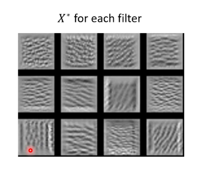

# Explainable ML

## Local Explaination

Why we get the result?

### Ways to Explain

We can use decision tree which is very complex however

1. Mask some components and observe the output to know which is important
2. Change a component slights to observe the change of loss function ($ \frac {\partial e} {\partial x_n} $)

The picture we get by this way is called saliency map

#### Better Saliency Map

##### Smooth Grad

The mean of saliency maps produced by different noisy pictures

##### Gradient Saturation

Gradient cannot always reflect importance

Like the trunk's length, if it's excessively long it will not make it more close to a elephant, then the gradient will become zero

This is a wrong answer, **so we can use intergrated gradient**

### How a Network Processes the Input Data

We can decrease the number of dimensions to observe the process

## Global Explaination

What is the expected features of the input?

$$ X^* = arg \underset{X}{\max} \sum \limits_{i} \sum \limits_j a_{ij} $$

The input we get by optimization should make the feature output by the layer as large as possible

Then we observe the pattern of the input to get a conclusion

For example, the 9th filter functions to detecting the slashes in a CNN used for classify numbers

The optimization result may be some noisies, just like the noises added to the attacked image

We can add some constraints to the optimization process to convert the image to a desirable shape

R(X) is your constraints

$$ X^* = arg \underset{X}{\max} \sum \limits_{i} \sum \limits_j a_{ij} \\ R ( X ) = - \sum \limits_{i , j} |X_{ij}| $$

We can concatenate a generator to a classifier to get the best input vector z which can get the best output y, and we can use the z to generator the image

