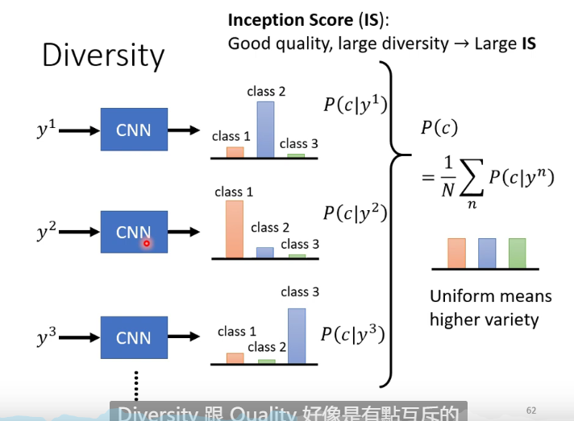

# Generative Adversarial Network

## Network as Generator

## Why Distribution?

The same input has different outputs

## GAN

### Discriminator

It is a neural network

Its output scalar measures how real the output is in positive correlation

### Basic Idea of GAN

The discriminator try to judge whether the output is real, and will evolve together with generator

### Algorithm

1. Initialize generator and discriminator
2. In each training iteration:
    Step1:Fix generator G, and update discriminator D

    Step2:Fix discriminator D, and update generator G

Generator:

Discriminator:

Y from data should be as big as possible, and y from G is contrary to that

The objective function is actually negative cross-entropy function which should be maximized

argmaxV(D,G) is related to JS divergence

## WGAN

### JS Divergence is Not Suitable

In most cases, $P_G$ and $P_{data}$ are not overlapped

1. The nature of data
   Both $P_{data}$ and $P_G$ are low-dim maniford in high-dim space

   The overlap can be ignored
2. Sampling
   Even though $P_{data}$ and $P_G$ have overlap, if you do not do enough sampling they will not overlap

   

JS divergence is always log2 if two distributions do not overlap

### Wasserstein Distance

1. Considering one distribution P as a pile of earch and another distribution Q as the target
2. The average distance the earth mover has to move the earth

Using the moving plan with the samllest average distance to define the Wassertein distance

### WGAN

Evaluate Wasserstein distance between $P_data$ and $P_G$

$$\underset {D \in 1 - Lipschitz}{max} \{ E_{x~ P_{data}} [D(Y)] - E_{x~P_G} [D(Y)]\}$$

D must be a smooth function because without the constraint the training of D will not coverage

Keeping the D smooth forces D(x) become $\infty$ and $-\infty$

We do not update discriminator a lot because it's too time-consuming

### GAN is Still Challenging

If generator or discriminator fails its work, the training cannot continue to update the model

Generator and Discriminator needs to match each other

## Evaludation

### Model Collapse

E.g. a image in generated data cannot be told by discriminator, then the image exist for many timnes

### Model Dropping

Generated data only cover part of the real data

### Frechet Inception Distance

Smaller is better

### We Don't Want Memory GAN

We want to generate new images instead of the real data

### Conditional Generation

Only when the input x and y match will the discriminator give a high score

## Learning from Unpaired Data

We cannot match x and y

### Cycle GAN

The second generator produce a image equaling to the original image

