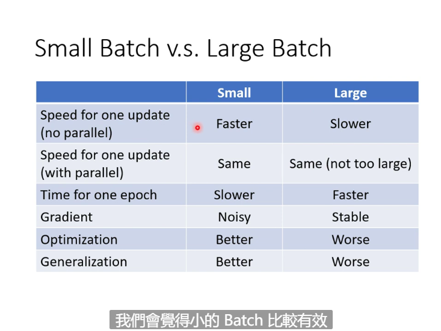
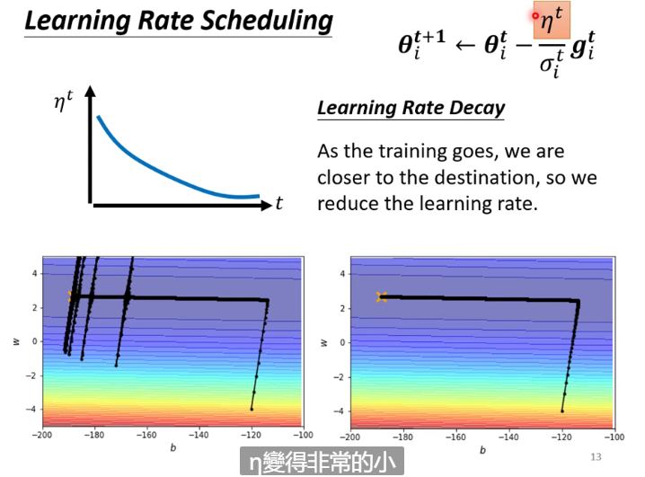
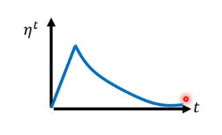
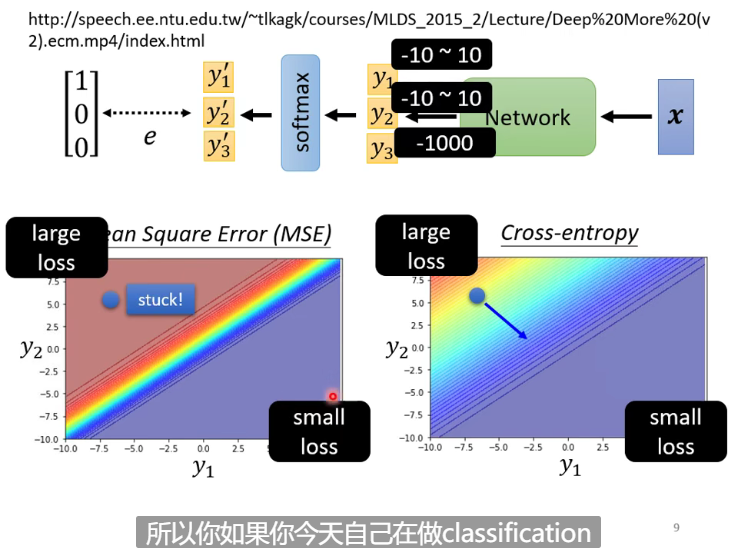
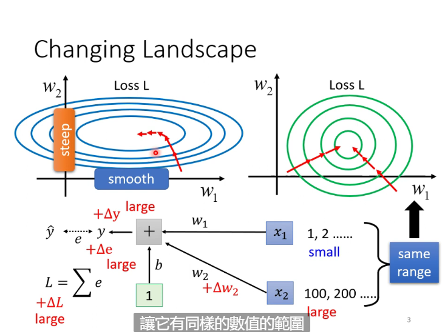

# Optimization

## Reasons of the Failure of Optimization

### Critical Point

1. Local minima: no way to go
2. Saddle point: can escape

#### How to Distinguish the Two Points?

$L(\theta)$ around $\theta = \theta^{'} $ can be approximated

$$ L(\theta) \approx L(\theta ^ {'}) + (\theta-\theta^{'})^T g + \frac{1}{2} (\theta-\theta^{'})^T H (\theta-\theta^{'})$$

Gradient *g* is a *vector*

$$ g = \nabla L(\theta^{'}) \quad  g_i = \frac{\partial L(\theta^{'})}{\partial \theta_i}$$

Hessian *H* is a *matrix*

$$ H_{ij} = \frac{\partial ^2}{\partial \theta_i \partial \theta_j}L(\theta^{'})$$

In the critial point, *g*=$\vec{0}$, so the type of the point is decided by the third formula (Hessian Matrix)

Actually minima or maxma seldom appears if we see the critical point in a high-dimension space

## Batch And Momentum

### Batch

if batch size is big, it needs more time to updata the parameters but the result is more accurate; instead, small size nedds shorter time and will run more times but get inaccurate result. Now GPU can provide parallel computing so the smaller batch may not consume that much time. Larger batches have less epoches. 

Smaller batch can get more loss function, so that if one batch is stuck we get use another batch to optimize

### Momentum

It can be used to solve the problem of critical point by make previous step minus gradienbt

$$ m^1 = \lambda m^0 - \eta g$$

## Ajust Learning Rate Automatically

### Training Stuck ≠ Critical Point

It may because the parameters are around a critical point

**We need to customize the learning rate for different parameters**

#### Learning Rate Adjustment

$$\theta_i^{t+1} \leftarrow \theta_i^t - \frac{\eta}{\sigma_i^t} g_i ^t$$

1.**Adagrad**
In flat place we set bigger learning rate, and in steep place we set smaller learning rate

$$\sigma_i^n = \sqrt{\frac{\sum\limits_{i=0}^{n}g_i ^2}{n+1}}$$

2.**RMSProp**

$\alpha$ is a **hypermeter**

$$\sigma_i ^n = \sqrt{\alpha(\sigma_i^{n-1})+(1-\alpha)(g_i^n)^2}$$

3.**Adam**

Adam=RMSProp + Momentum

#### Learning rate scheduling

$$\theta_i^{t+1} \leftarrow \theta_i^t - \frac{\eta^t}{\sigma_i^t}g_i^t$$

**1.Learning rate Decay**:As the training goes, we are closer to the destination, so we reduce the learning rate

**2.Warm up**: Increase and then decrease (**the speed is a hyperparameter**)

## Classification

Class as **one-hot vector**  (vector that only have one valid bit， such as $ \vec{v} = \left[ \begin{matrix} 1 \\ 0 \\ 0\end{matrix} \right]$ )

$$ y = b^{'} + W^{'} \sigma (b+Wx)$$

$$ \hat{y} \dashleftarrow \dashrightarrow y^{'} = softmax(y) $$

**Softmax**: normalize $\vec{y}$ to make each value in it between 0 and 1

$$ y_i^{'} = \frac{e^{y_i}}{\sum\limits_j e^{y_j}}$$

If the number of class $\geq$ 3, we use softmax, or we use sigmoid

### Loss of classification

1. MSE

$$ e = \sum\limits_i (\hat{y_i} - y_i^{'})^2$$

2. Cross-entropy (It's used more common):

$$e = -\sum\limits_i \hat{y_i}ln y_i^{'}$$

(Minimizing cross-entropy is equivalent to maximizing likelihood)

**Cross-entropy is often tied with softmax**

When using MSE, the place where loss is large is very flat that gradient cannot move the paraments, but we can do it using cross-entropy

## Batch normalization

This is a way to 'change landscape'

If the scale of different dimensions in a feature differs a lot from each other, the gradient in different directions in the error surface can have a huge difference 

The next is the solution

### Feature normalization

For each dimension i, calculate mean: $m_i$ and standard deviation: $\sigma_i$

$$ \widetilde{{x_i^{r}}} = \frac{x_i^{r} - m_i}{\sigma_i}$$

Then mean in each dimension will be near 0 and variances will be near 1

In one batch, we do normalization in every layer, this process is called **batch normalization**

After getting $\tilde{z}^i$, we'll do this:

$$\hat{z}^i = \gamma \bigodot \tilde{z}^i + \beta$$

($\bigodot$ means every elements do multiplication separately)

This operation change the range in one dimension, usually $\gamma = \vec{1}$ and $\beta = \vec{0}$, and It changes according to your need