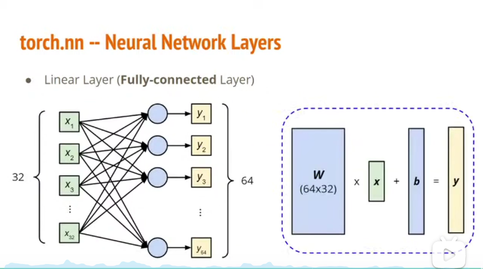
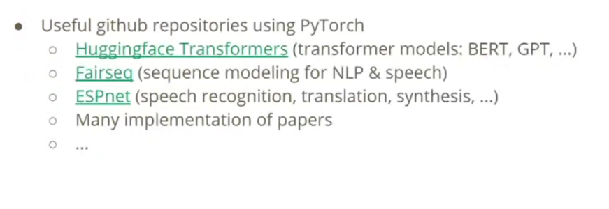

## PyTorch

### Tensor

Similar to array in NumPy

```python
import torch
#Tensor constructor

x = torch.tensor([1, 1],[1, 1]) #It has two dimensions
x = torch.zeros([2, 2]) #All 0 array, and the parament is the shape
x = torch.ones([1, 2, 3]) #All 1 array

#Tensor operators

x.dtype() #The type of x
x.shape() #The shape of x
x = x.squeeze(0) #The first dimension will be removed
x = unsqueeze(0) #The first dimension will be added
x = x.transpose(0, 1) #Exchange the first and second dimension
w = torch.cat([x, y, z], dim = 1) #Join the dimension that except this dimension each dimension has the same size in these vectors
#For example. x.shape = [2, 1, 3]
#             y.shape = [2, 3, 3]
#             z.shape = [2, 2, 3]
#        Then w.shape = [2, 6, 3]

#Tensor device

x = x.to('cpu') #to CPU
x = x.to('cuda') #to GPU
torch.cuda.is_available() #Check whether the PC has CUDA
# GPU has a better performance in parallel computing

#Calculate gradient

x = torch.tensor([[1., 0.], [-1., 1.]])
z = x.pow(2).sum()
z.backward() #The calculation step
x.grad #Demonstrate the gradient
```

## Dataset & Dataloader

```python
from torch.utils.data import Dataset, DataLoader

class MyDataset(Dataset):
    def __init__(self, file):
        self.data = #
    def __getitem__(self, index):
        return self.data[index]
    def __len__(self):
        return len(self.data)

dataset = MyDataset(file)

dataloader = DataLoader(dataset, batch_size, shuffle=True)
```
## torch.nn

### Neural Network Layers

```python
nn.Linear(in_features, out_features)# Fully-connected layer
```

in_features = 32, out_features = 64 e.g.


In this case, layer.weight.shape == [64, 32], layer.bias.shape == ([64])

## Loss Functions

```python
nn.MSELoss() #MSE
nn.CrossEntropyLoss() #Cross-entropy
```

# Build

```python
import torch.nn as nn

class MyModel(nn.Module):
    def __init__(self): #Initialize
        super(MyModel, self).__init__()
        self.net = nn.Sequential(
            nn.Linear(10, 32)
            nn.Sigmoid()
            nn.Linear(32, 1)
        )
    def forward(self, x): #Compute output of NN
        return self.net(x)
```

## torch.optim

```python
torch.optim.SGD(params, lr, momentum = 0)
#Stochastic Gradient Descent
#param is the parameters of my model
#lr is learning rate
```

## Neural Network Training

```python
dataset = MyDataset(file)
tr_set = DataLoader(data, 16, shuffle = True) #Put dataset into dataloader
model = MyModel().to(device)
criterion = nn.MSELoss()
optimizer = torch.optim.SGD(model, parameters(), 0.1)

for epoch in range(n_epoch):
    model.train() #Set model to train mode
    for x,y in tr_set:
        optimizer.zero_grad()
        x, y = x.to(device), y.to(device)
        pred = model(x)
        loss = criterion(pred, y)
        loss.backward()
        optimizer.step()
```

## Neural Network Evaluation

```python
model.eval() #Set model to evaluation model
total_loss = 0
for x,y in dv_set:
    x, y = x.to(device), y.to(device)
    with torch.no_grad(): # Disable gradient calculation
        pred = model(x)
        loss = criterion(pred, y)
    total_loss + = loss.cpu().item() * len(x)
    avg_loss = total_loss / len(dv_set.dataset)
```

## Testing Set

```python
model.eval()
preds = []
for x in tt_set:
    x = x.to(device)
    with torch.no_grad():
        pred = model(x) #forward pass (compute output)
        preds.append(pred.cpu()) #Collect prediction
```

## Save\load A Neural Network

### Save
```python
torch.save(model.state_dict(), path)
```

### Load
```python
ckpt = torch.load(path)
model.load_state_dict(ckpt)
```

## More


