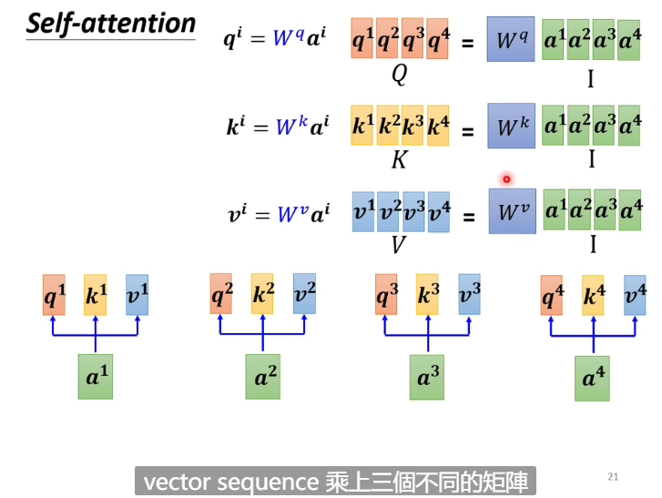
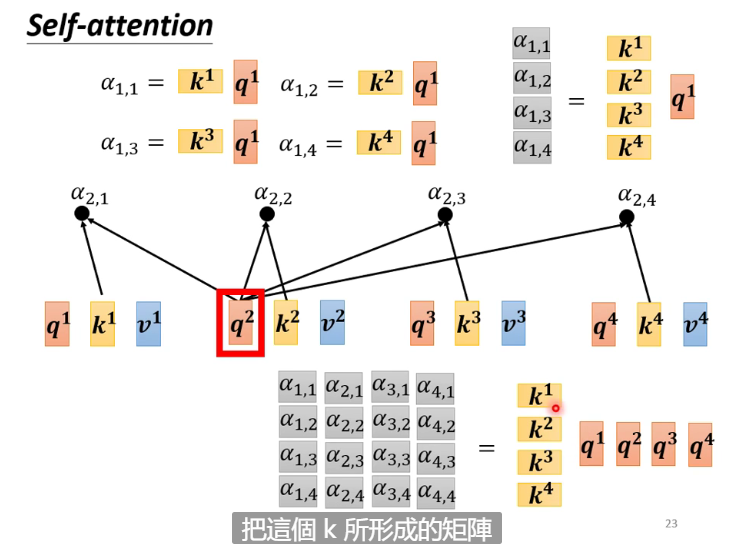
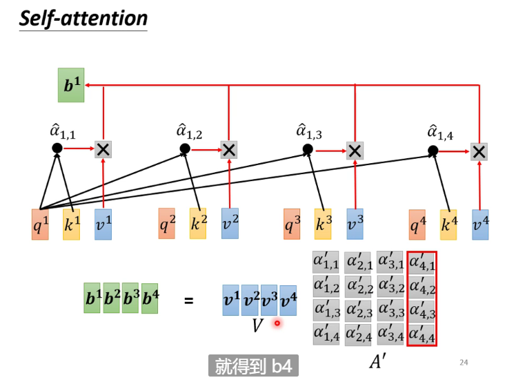

# Self-attention

The input is a vector set, and the size of output can be different

## Sequence Labeling

The size of input and that of output are the same

Put the input into the network then every input will get a label

We can also put several inputs into one network

But when we need to put the whole sequence into the network, because the length of every sequences is different that we need to use self attention

## Self-attention

Compute the relevance first, then do a soft-max (other methods are also OK)

Get q,k,v first

Then we get the relevance matrix

Now we can compute b ($\hat{a}$ should be $a^{'}$)

### Positional Encoding

Add position information (position vector $e_i$) to self-attention

