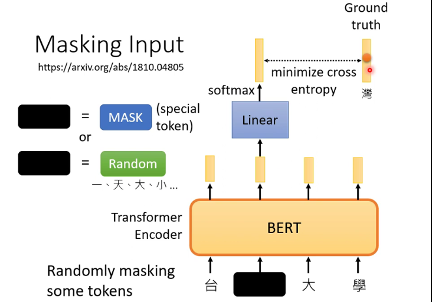
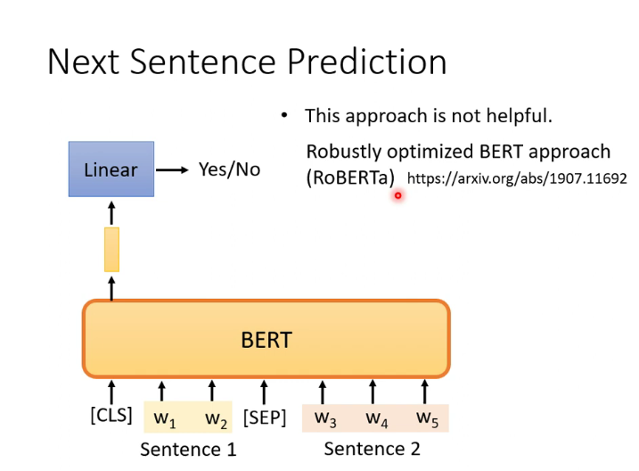
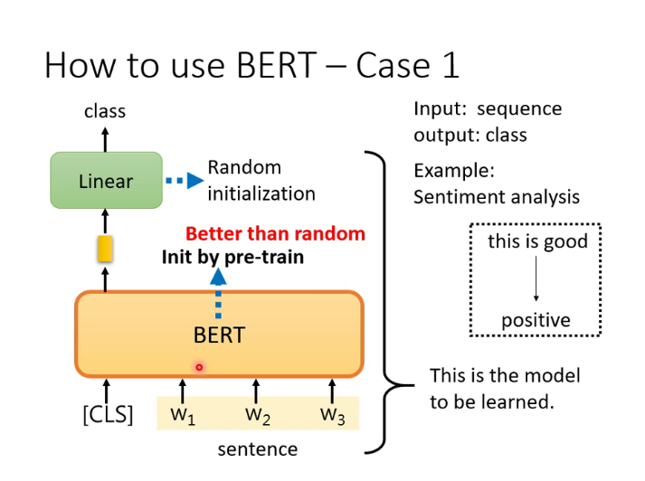
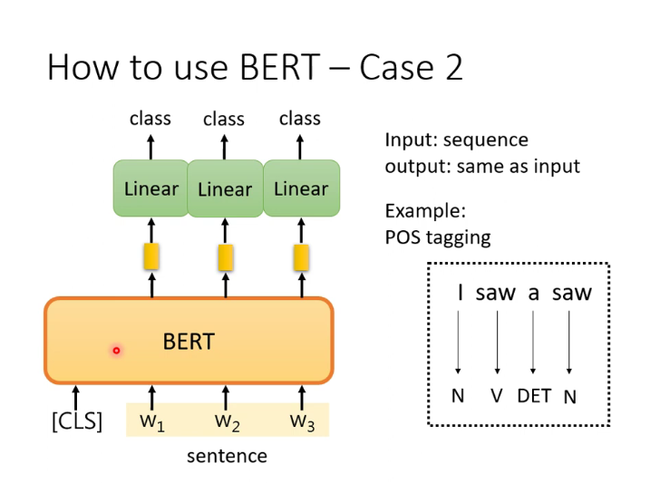
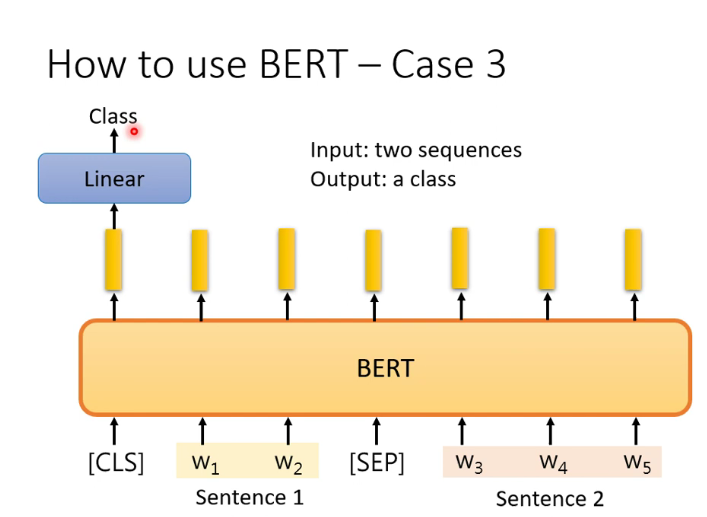
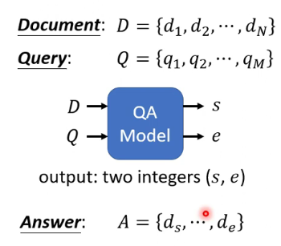
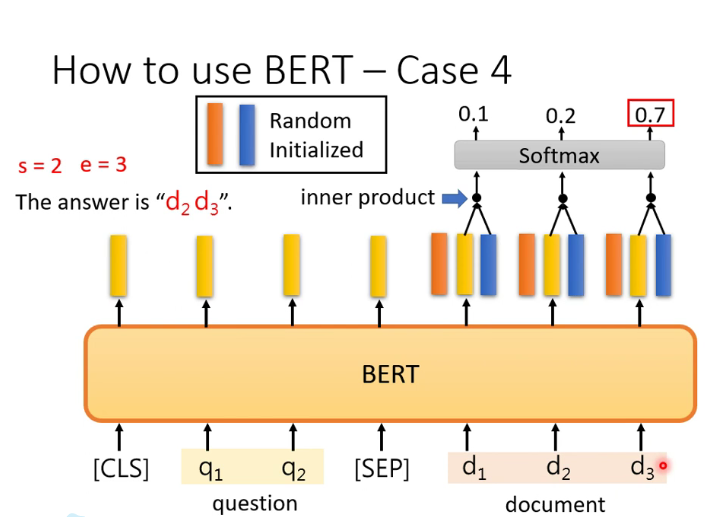
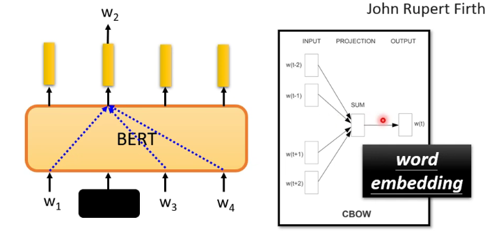
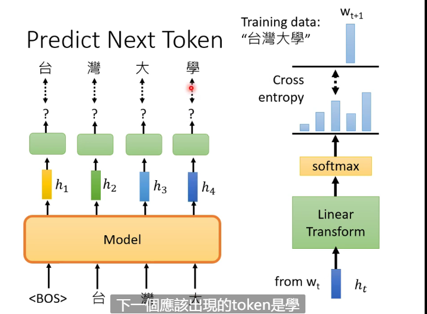
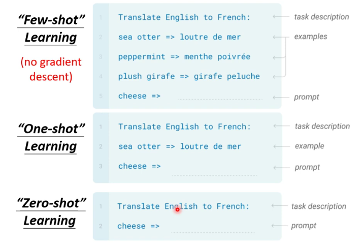

# Self-supervised Learning

Supervised learning using data and label to train

Self-supervised learning doesn't have label that it divide the data into two parts, one part put in the model, the other functioning as label

It's a kind of unsupervised learning

## BERT

Often used in NLP

### Masking Input

Randomly mask some tokens and let the output as close to original token as possible

### Next Sentence Prediction

Add separate token and CLS token to a sentence and we only choose the output of CLS

Then it will output the result that whether the two separated sentence can be catenated

### Downstream Tasks

This are the tasks we really care by fine-tune(微调)

We still use supervised learning in these tasks, but the BERT model comes from self-supervised learning, so they are called **semi-supervised learning**

#### Case 1

Input: Sequence

Output: Class

Example: Sentiment analysis

The diameters of BERT come from pre-trained model, and the linear part is still randomized

The model's performance will be better than the model using randomized BERT

#### Case 2

Input: Sequence
Output: Sequence with the same length

Example: POS tagging

#### Case 3

Input: Two sequences

Output: A class

Example: Natural Language Inferencee (NLI)

We give a premise and a hypotheis to the model to judge whether we can get the hypothesis from the premise, contradiction, entailment or neutral

#### Case 4

Extraction-based Questioning Answering

We input the document and query to get two integer which marks the position of the answer (from $s^{th}$ word to $e^{th}$ word)

We use two random initialized vectors to do inner product with the output of BERT to get the result

#### Case 5

Destruct the input of encoder then make the decoder output the original result

### BERT Embryology

Observing the learning process of BERT to know how it gets the ability

### Why BERT Works

We can use BERT to use word embedding (similarity between two words)

We use self attention to get the masked token

Bird is also called **contextualized word embedding**

#### Multi-lingual BERT

If bert successfully learns QA in one language, the model can also be used in other languages

## GPT

We use the model to predict next token using masked-attention in the BERT

### Downstream Tasks

 