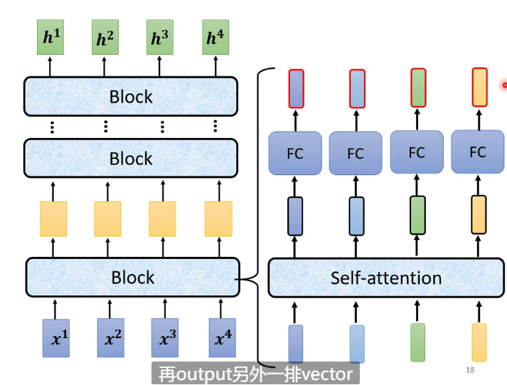
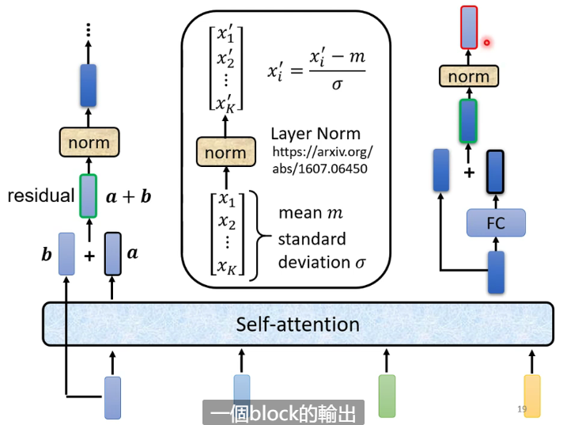
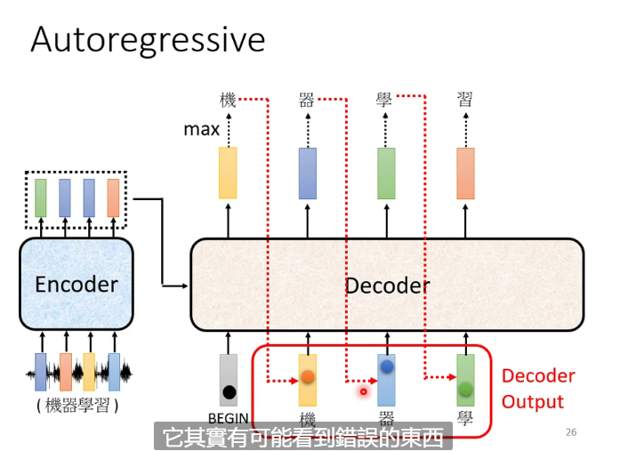
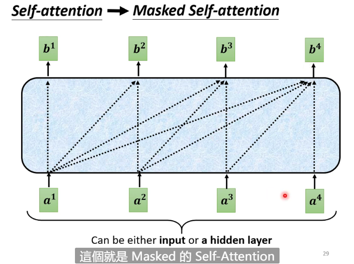
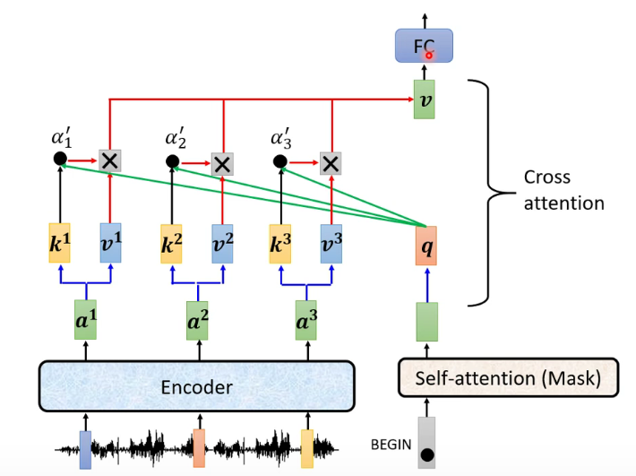
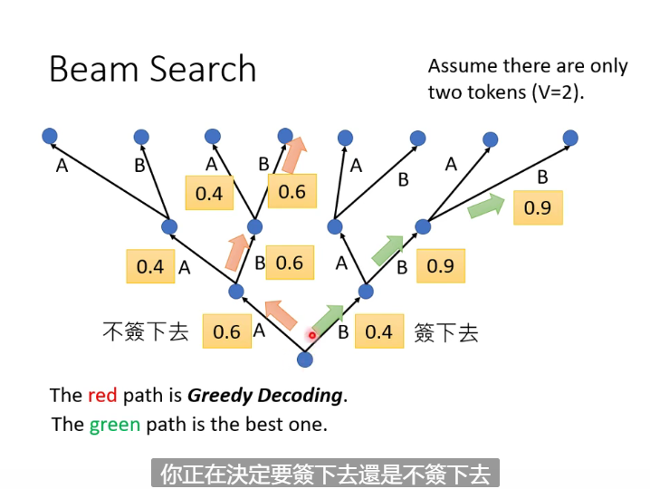

# Transformer

A sequence-to-sequence model

The output length is determined by model

Seq2seq model is usually divided into 2 parts:

Encoder: In charge of processing the input

Decoder: In charge of deciding the output

## Encoder

Encoder can use RNN or CNN

**Layer normalization**:$x_i^{'} = \frac{x_i - m}{\sigma}$

## Decoder

### Autoregressive

Speech recognition as example

Firstly, give decoder a special token called BOS(Begin of sentence) to begin decoding

Then decoder will give out a vector, including all vocabulary like all chinese characters as vector elements, and it will output the element with the biggest weight

Then the output and BOS will be the next input, repeat the process until get the result

A wrong output may cause error propagation

### The Structure of Decoder

Self-attention -> Masked Self-attention : The layer can only use a in the left to get b

This is similar to the operation process of decoder

The length of input and that of output can be different

We also need a stop token called end

We hope the decoder will output end in the end

### Nonautoregressive

Output the whole sentence in one time with the input of an array filled with begin

## Cross attention

How the decoder get information from the encoder

## Training

### Teacher forcing

Give the correct output when give decoder the input

### Copy Mechanism

Copy some words form the input as output (e.g. names)

### Beam Search

It's unable for us to check all possible paths, so we need to use beam search to find an approximately more optimal path

In some cases the path with highest score may not be the best