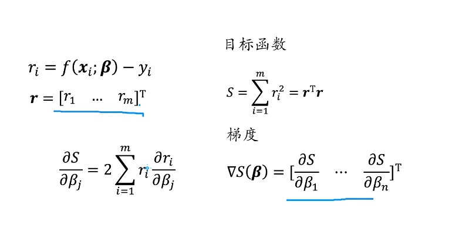

# 传统视觉里程计

## 特征点法

从图像中提取出关键特征点，然后通过匹配特征点的手段估计出相机运动

### 特征点提取及匹配

#### Harris算法

应用邻近像素点灰度差值概念，从而进行判断是否为角点、边缘、平滑区域

算法的核心是利用局部窗口在图像上进行移动判断灰度发生较大的变化

将每个像素的梯度坐标表示为 $(I_x,I_y)$

用M的特征值来判断角点、边缘、平面

可以用特征值计算角点响应函数来判断

Harris算子具有旋转不变性，因为旋转之后的M是相似矩阵特征值相同，但是尺度变化之后特征值不再相同

#### SIFT算法

https://www.cnblogs.com/linyunzju/archive/2011/06/14/2080950.html

https://www.cnblogs.com/cfantaisie/archive/2011/06/14/2080917.html

https://www.bilibili.com/video/BV1Qb411W7cK?p=2&spm_id_from=pageDriver

#### SURF算法

##### 积分图

二元函数的积分，即将(x,y)左上角所有像素的值进行相加，递推可以更快的得到:

$$SAT(x,y)=SAT(x-1,y)+SAT(x,y-1)-SAT(x-1,y-1)+I(x,y)$$

$I(x,y)$ 为该点像素值

SIFT算法中图像的尺度是不同的，但是SIFT算法中图像尺度相同而盒滤波器的高斯尺度不同，采用haar小波特征

https://www.jianshu.com/p/d6f524178a23

##### haar小波

https://blog.csdn.net/lanxuecc/article/details/52222369

#### ORB算法

https://zhuanlan.zhihu.com/p/261966288#:~:text=1.%E7%AE%97%E6%B3%95%E7%AE%80%E4%BB%8B.%20ORB%20%E6%98%AF%20Oriented%20Fast%20and%20Rotated%20Brief,%E7%AE%97%E6%B3%95%E5%88%9B%E5%BB%BA%E7%9A%84%E7%89%B9%E5%BE%81%E5%90%91%E9%87%8F%E5%8F%AA%E5%8C%85%E5%90%AB%201%20%E5%92%8C%200%EF%BC%8C%E7%A7%B0%E4%B8%BA%E4%BA%8C%E5%85%83%E7%89%B9%E5%BE%81%E5%90%91%E9%87%8F%E3%80%82.%201%20%E5%92%8C%200%20%E7%9A%84%E9%A1%BA%E5%BA%8F%E4%BC%9A%E6%A0%B9%E6%8D%AE%E7%89%B9%E5%AE%9A%E5%85%B3%E9%94%AE%E7%82%B9%E5%92%8C%E5%85%B6%E5%91%A8%E5%9B%B4%E7%9A%84%E5%83%8F%E7%B4%A0%E5%8C%BA%E5%9F%9F%E8%80%8C%E5%8F%98%E5%8C%96%E3%80%82.

### 位姿估计

通过分析相机与空间点的几何关系，从而计算出把 K－1 时刻的相机位姿变换到 K 时刻相机位姿的变换矩阵 Tk，k－1 ． 根据时间序列把相邻时刻的运动串联起来，这样就构成了机器人或者相机的运动轨迹

#### ICP算法

##### 坐标系之间的转换

https://zhuanlan.zhihu.com/p/282497081

上图是原来的小孔成像的模型.由于在像平面上得到的是倒像，所以我们将像平面翻转到光轴正方向上得到的坐标也是对的

#### 对极几何方法

用八点法求本质矩阵

https://blog.csdn.net/kokerf/article/details/72630863

#### PnP方法

https://blog.csdn.net/leonardohaig/article/details/120756834

## 直接法

直接法不同于特征点法最小化重投影误差，而是通过最小化相邻帧之间的灰度误差估计相机运动，但是基于灰度不变假设

# 惯性视觉融合

IMU 与相机传感器结合，称为视觉惯性里程计 VIO ( Visual-Inertial Odometry) ，可以分为基于滤波和基于优化的两大类 VIO，也可以根据两个传感器数据应用的方法不同分为松耦合和紧耦合．松耦合是指 IMU 和相机分别进行位姿估计，紧耦合是指相机数据和 IMU 数据融合，共同构建运动方程和观测方程进行位姿估计

# 基于深度学习的视觉里程计

## PoseNet

### SfM

### 单应性

https://zhuanlan.zhihu.com/p/74597564

## MagicPoint & MagicWarp

https://zhuanlan.zhihu.com/p/69492701

# 闭环检测

## LSH

https://zhuanlan.zhihu.com/p/225949044

## PCA

https://zhuanlan.zhihu.com/p/37777074

# 视觉重定位

## 场景表达模型

https://mp.weixin.qq.com/s/Dv51K8JETakIKe5dPBAPVg

DSAC++,HSCNet,EMOSC(xyzNet)

## 场景信息匹配

kd树

https://www.joinquant.com/view/community/detail/c2c41c79657cebf8cd871b44ce4f5d97

kmeans

https://zhuanlan.zhihu.com/p/77632985

# kaiming_normal_

https://towardsdatascience.com/understand-kaiming-initialization-and-implementation-detail-in-pytorch-f7aa967e9138

https://zhuanlan.zhihu.com/p/64464584

# torch.unsqueeze(x)

在第x维这里增加一个维度，如$(2,3)\rightarrow(2,1,3)$

# 重投影误差

https://www.cnblogs.com/Jessica-jie/p/7242179.html

# 高斯牛顿法

https://blog.csdn.net/qq_42138662/article/details/109289129

https://blog.csdn.net/jinshengtao/article/details/51615162

# 四元数

https://zhuanlan.zhihu.com/p/27471300